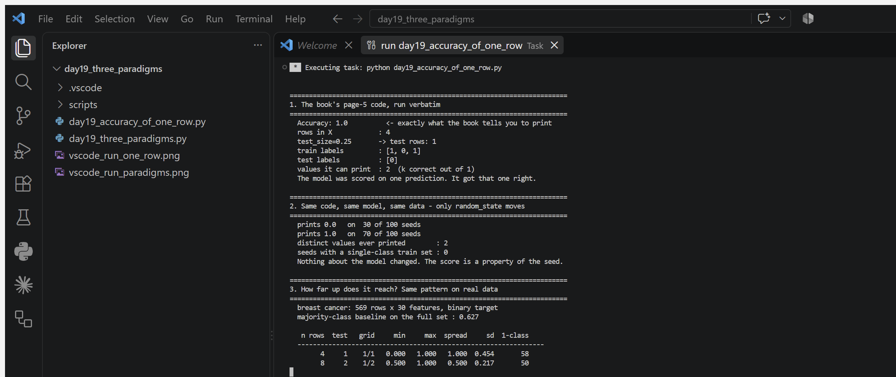
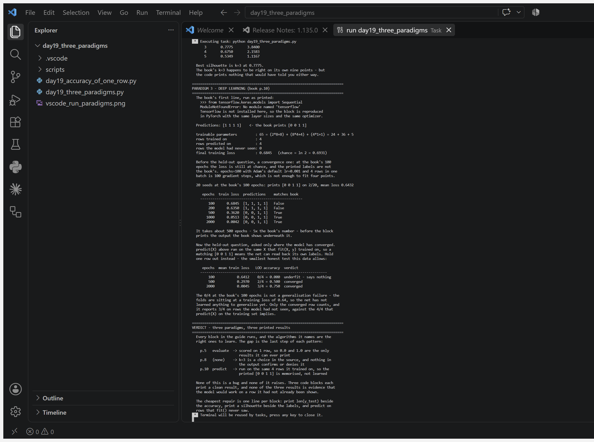

# python-daily

One focused Python exercise per day. Each file is self-contained and runnable: `python dayNN_topic.py`. Standard library only unless noted.

## Progress

| Day | File | What it shows |
|-----|------|---------------|
| 01 | day01_data_quality_checker.py | Column-level CSV quality checks: nulls, duplicate keys, numeric ranges, regex formats |
| 02 | day02_reconcile_datasets.py | Source-vs-target reconciliation: key set diff, duplicate keys, field-level mismatches, match rate |
| 03 | day03_log_parser.py | Web-server log parsing with one named-group regex: request counts, status distribution, error rate, slowest endpoints, top talkers |
| 04 | day04_rag_chunker.py | Overlapping text chunking for RAG: fixed word-size windows with overlap, splitting on paragraph/sentence boundaries so ideas stay whole |
| 05 | day05_pytorch_tensors.py | PyTorch tensor fundamentals: creation (rand/tensor/ones/zeros), rank & shape, indexing, element-wise math, .item(), NumPy bridge, device selection, and a first look at autograd (uses torch + numpy) |
| 06 | day06_sql_with_sqlite.py | SQL via sqlite3: INNER/LEFT joins, GROUP BY/HAVING, and data-validation queries (orphan records, duplicates, business-rule checks) on a tiny claims DB |
| 07 | day07_autograd_training_loop.py | PyTorch autograd: manual linear-regression training loop (forward, MSE, backward(), hand-written SGD, grad zeroing, un-standardizing learned weights). No nn.Module, no optimizer (uses torch) |
| 08 | day08_csv_json_wrangler.py | CSV to JSON wrangler: best-effort type coercion (int/float/string/None), required-field validation that skips bad rows with line-numbered errors instead of crashing, stable-key JSON output with round-trip check |
| 09 | day09_forecast_table.py | National forecast table parser: regex tokenizing of packed "hi/lo/sky" cells with a code legend, dataclasses for today vs next-day, rejects malformed rows instead of crashing, and reports hottest/coolest/widest-swing cities and sky distribution |
| 10 | day10_eval_metrics.py | Evaluation metrics from scratch: precision/recall/F1 with zero-division handling, confusion matrix, macro averaging, sklearn-style report, and a spam-filter demo showing why accuracy flatters lazy models on imbalanced data |
| 11 | day11_one_hot_encoding.py | One-hot encoding from scratch (Low-Code AI, Stripling & Abel): why ordinal codes invent a false magnitude, stable category ordering between train and serve, and unseen categories encoding as all-zeros instead of crashing |
| 12 | day12_mode_imputation.py | Mode imputation for missing categorical values (Low-Code AI, ch. 2): deletion vs imputation, the many spellings of "missing" in real CSVs, deterministic alphabetical tie-breaking, and returning None when a column is entirely missing |
| 13 | day13_feature_scaling.py | Min-max scaling and its two failure modes (Low-Code AI, Stripling & Abel, p. 24): one outlier crushing every real value to 0, a constant column dividing by zero, and median/IQR robust scaling as the alternative |
| 14 | day14_musk_token_economics.py | Tokenizer byte economics (Hands-On LLM, pp. 74/78/82): GPT-style byte fallback means a brand name in Telugu or Hindi bills 3-6x its English cost; measures Musk company names across 6 market scripts, with xAI as the 1.00x control |
| 15 | day15_gil_threads_vs_processes.py | The global interpreter lock measured (Dive into Deep Learning, p. 270): the same CPU-bound work run serially, on threads and on processes, where threads give no speedup at all (0.90x to 1.04x across four runs) while processes give 2.08x, then the same three ways on I/O-bound work where the same threads give 3.97x. verify_day15.py re-times everything independently and asserts both claims. Same tool, opposite result, depending on what the work is waiting for |
| 16 | day16_validation_selection_bias.py | The third dataset (Low-Code AI, Stripling & Abel, PDF pp. 268-269): labels are coin flips, so 0.500 is the honest ceiling. Pick the best of 60 candidate models on one validation set and it scores 0.610 there against 0.507 on the untouched test set - but one run proves nothing, since a single test set is noisy enough to drift a point either way. Over 200 runs the winner averages 0.606 validation against 0.498 test, flattering in 200/200 runs by +0.107. Rerun on data with real signal and the gap falls to +0.011 |
| 17 | day17_drift_alarm_precision.py | Data-drift monitoring scored on false alarms (Practical MLOps, Gift & Deza, ch. 6, PDF pp. 200-204): the book's auto-suggested constraint baseline fires on a harmless 99.7%-integral batch and is silent on a Fahrenheit-to-Celsius unit swap, scoring precision 0.50 / recall 0.33 across six hourly batches; a 99%-tolerance detector with a mean-shift check gets 0.75 / 1.00. The remaining false alarm is not fixable: the seasonal-zero and dead-feed batches profile identically, so a data-only detector fires on both (0.75 precision) or neither (0.67 recall). [VS Code run](screenshots/day17_vscode_run.png) |
| 18 | day18_duplicate_leakage.py | "No duplicates" as a cleaning checkbox (Ribeiro, *Complete lifecycle of ML models* Part 2, ch. 3, PDF pp. 36 & 44): `df.drop_duplicates()` removes only rows that are equal in every column, so on 600 rows holding 200 re-entered customers it drops the 50 exact copies and, once every row carries a real primary key, drops 0 of 600 while all 200 stay. The re-keyed, rounded and whitespace-typed copies survive either way, and a random split then puts 30% of test rows in the same customer as a training row. Averaged over 10 splits, 1-NN reports 0.726 on the random split against 0.606 on a customer-grouped split of the same cleaned data - a +0.120 memory bonus, on a task whose Bayes ceiling is 0.75 and whose majority baseline is 0.505 |
| 18b | book_check_fillna_inplace.py | The same book's cleaning block run verbatim on current pandas (*Data Engineering Made Simple: SQL, Python, PySpark*, ch. 7, p. 41): `patients['Diagnosis'].fillna('Unknown', inplace=True)` fills 3 of 3 nulls on pandas 2.3.1 with only a FutureWarning, and fills 0 of 3 under Copy-on-Write - the pandas 3.0 default - raising ChainedAssignmentError and leaving the frame untouched. The chained selection is filled and discarded. Assigning the result back works in both modes. [VS Code run](screenshots/day18_book_cleaning_check.png) |
| 19 | day19_accuracy_of_one_row.py | **"Accuracy: 1.0" printed from a test set of one row** (*Machine Learning: The 3 Core Paradigms*, Zarnappa Earnoor, p. 5, "Paradigm 1 - Supervised Learning - Python code example"). Nothing here is deprecated and nothing raises: the block runs and prints a number. Its `X` has four rows, so `test_size=0.25` hands the metric **one** prediction to score, and an accuracy over one row has exactly **two reachable values**. Run verbatim it prints **1.0**. Sweep `random_state` 0-99 with the model, the data and the split fraction untouched and the same line prints **1.0 on 70 seeds and 0.0 on 30** - no other value ever appears, so the score is a property of the seed rather than of the model. Scaling the identical pattern up on breast cancer (569x30, majority baseline 0.627), the reported score's sd falls **0.454 -> 0.217 -> 0.145 -> 0.080 -> 0.052 -> 0.022** as the test set grows from 1 to 100 rows - a 20x tightening driven only by test-set size, since it is the same forest with the same seed on every line. At the book's own n=4, **58 of 200** seeds train on a single class and still print an accuracy. The catch is that the means agree with repeated 5-fold (0.927 vs 0.930 at n=40): one split is not biased, it is unbiased and *wide*, and you do not publish the mean - you publish one draw from a range that runs **[0.600, 1.000]** for a model that never changed. Distinct from Day 16, which is bias in the *choice* of model; this is variance and resolution in the *measurement*. [VS Code run](screenshots/day19_accuracy_of_one_row.png) |
| 19b | day19_three_paradigms.py | **All three of the guide's code blocks, implemented and run** (*The 3 Core Paradigms*, pp. 5, 8, 10). Every block executes and every block prints a confident result; none of the three ever scores the model on a row it had not already seen. **p.5 supervised** - accuracy on 1 held-out row (above). **p.8 unsupervised** - `KMeans(n_clusters=3)` on nine points has no evaluation step at all, and `n_init` resolves to **1** because the book never sets it; silhouette across k=2..5 scores **0.6733 / 0.7775 / 0.6750 / 0.5349**, so the book's k=3 is right on its own data - but its output prints nothing that would have said so either way. **p.10 deep learning** - `from tensorflow.keras.models import Sequential` raises `ModuleNotFoundError` on this machine, so the net is rebuilt in PyTorch with the same 65 parameters (8-relu/4-relu/1-sigmoid, Adam, BCE). At the book's `epochs=100` it has **not converged**: loss **0.6845** against chance at ln2 = **0.6931**, and it prints the book's `[0 0 1 1]` on only **2 of 20** seeds - it takes ~**500 epochs**, 5x the book's number, to reproduce the output printed beneath the snippet. Converged, `predict(X)` runs on the same four rows `fit()` trained on, which is reading back its own labels; leave-one-out on those rows reports **3/4** at 2000 epochs, while the 0/4 at the book's 100 epochs is an **underfitting artifact** (mean fold loss 0.6412), not a generalisation failure. [VS Code run](screenshots/day19_three_paradigms.png) |
| 20 | day20_sparse_matrix_netflix.py | **The Netflix sparse-matrix claim, measured on a real downloaded dataset** (*Machine Learning with Python Cookbook*, Recipe 1.3 "Creating a Sparse Matrix", PDF p.6, plus the same book's URL-download method, ch. 3.0 p.37). The book motivates CSR with a Netflix users x movies matrix and "significant computational savings", then demonstrates it on a 3x2 array holding two non-zero values, and measures nothing. Downloading the book's own Titanic CSV and one-hot encoding `Name` gives a real 1,313 x 1,310 people-by-items matrix that is **99.92% zero**: dense 13.12 MB vs CSR 0.02 MB, **655x smaller**, both measured, round-trip lossless. The book also never says the saving has a limit - CSR stores a value *and* a column index per non-zero, so it crosses over and becomes **more** expensive than dense at **~67% density** (predicted 1.35x at 90%, measured 1.35x). And the 3x2 toy never exposes that `csr_matrix` silently **sums duplicate coordinates**: three separate `(0,5)` events store one cell of value 3 - correct for watch counts, silent corruption for ratings. |
| — | labelencoder_alphabet.py | `LabelEncoder` assigns the positive class by the alphabet, and the book's own fix does not fix it (*Low-Code AI*, ch. 6, PDF p. 247). The book says "Yes is being treated as the positive class, or 1" - true only because Y sorts after N. On one identical model over 5,000 rows, recall reads **0.544** when the event word sorts last and **0.954** when it sorts first: a fraud detector finding 54% of fraud reports 95%, because sklearn's metrics default to `pos_label=1` and are quietly scoring the legitimate rows. The book's aside - "ensure the order by fitting on ['No','Yes']" - was tested both ways on scikit-learn 1.8.0 and changes nothing, because `LabelEncoder` sorts whatever you fit it on. Naming the class at the metric restores 0.544. [VS Code run](screenshots/labelencoder_alphabet.png) |
| — | keras_lr_silent_default.py | The book's compile line does not run, and the obvious repair is not the book's model (*Deep Learning Illustrated*, Krohn, Beyleveld & Bassens, ch. 8, Examples 8.1-8.2, pp. 127-128). `SGD(lr=0.1)` raises `ValueError: Argument(s) not recognized: {'lr': 0.1}` on Keras 3.15.1 - `lr` was removed. The message names the argument it rejected but not `learning_rate`, which replaced it, so "not recognized" reads like "delete this". Deleting it is silent: SGD falls back to `learning_rate=0.01`, a tenth of the book's value, with no warning and no error. Trained on MNIST at seed 19 for the book's 20 epochs, keeping 0.1 gives val_acc **0.9752** and dropping the argument gives **0.9467**, a **0.0285** gap - and 10 epochs to reach what the book's rate reaches in 1. The architecture itself is untouched: 4,160 parameters in the second Dense layer, exactly as printed on p. 127, and the book's own figures still hold (92.34% to a measured 92.78% at epoch 1, ~97.6% to 97.52% at epoch 20). The book was right. Its code just stopped running. [VS Code run](screenshots/keras_lr_silent_default.png) |
| — | kmeans_ninit_default.py | The book never passes `n_init`, so its line inherits scikit-learn's default — and that default changed from `10` to `'auto'` in v1.4 (*50 Algorithms Every Programmer Should Know*, Imran Ahmad, Packt, ch. 6, `Unsupervised_Machine_Learning_Algorithms.ipynb` cell 5: `cluster.KMeans(n_clusters=2)`). Fitted rather than read from the docs, `'auto'` resolves to **1** under the default `init='k-means++'` and to **10** under `init='random'` — one default silently depending on another argument the book also never sets. k-means is only guaranteed a local optimum per restart, so on UCI handwritten digits (1797x64, k=10, ships with scikit-learn; directory source *Datascience public datasets.pdf* p.23) across 30 seeds the printed line lands worse on **28/30**, median gap **+0.40%**, worst seed **+4.58%**. Inertia spread widens from **637.2** to **53,470.4** — the same line is 84x less stable — and mean ARI against the true digit falls **0.6677 to 0.6378**, worst-seed ARI **0.6603 to 0.5628**. No error and no warning in either direction. The change bought real speed (**4.66s to 1.36s** for 30 fits, 3.4x), so the repair is not to revert it but to write the default down: `KMeans(n_clusters=10, n_init=10)`. [VS Code run](screenshots/kmeans_ninit_default.png) |

## Day 19 - the run

Source: *Machine Learning: The 3 Core Paradigms*, Zarnappa Earnoor - a field guide that
gives one runnable Python block per paradigm. All three blocks run. All three print a
confident result. None of the three ever tests the model on a row it had not already seen.

| book page | the printed result | what it was measured on |
|---|---|---|
| p.5 supervised | `Accuracy: 1.0` | 1 held-out row - only 0.0 and 1.0 are reachable |
| p.8 unsupervised | `Cluster Labels: [2 2 2 0 0 0 1 1 1]` | nothing - the block has no evaluation step |
| p.10 deep learning | `Predictions: [0 0 1 1]` | the same 4 rows it trained on |

### `day19_accuracy_of_one_row.py`



<details>
<summary>Full output</summary>

```text
========================================================================
1. The book's page-5 code, run verbatim
========================================================================
  Accuracy: 1.0          <- exactly what the book tells you to print
  rows in X            : 4
  test_size=0.25       -> test rows: 1
  train labels         : [1, 0, 1]
  test labels          : [0]
  values it can print  : 2  (k correct out of 1)
  The model was scored on one prediction. It got that one right.

========================================================================
2. Same code, same model, same data - only random_state moves
========================================================================
  prints 0.0   on  30 of 100 seeds
  prints 1.0   on  70 of 100 seeds
  distinct values ever printed        : 2
  seeds with a single-class train set : 0
  Nothing about the model changed. The score is a property of the seed.

========================================================================
3. How far up does it reach? Same pattern on real data
========================================================================
  breast cancer: 569 rows x 30 features, binary target
  majority-class baseline on the full set : 0.627

   n rows  test   grid     min     max  spread     sd  1-class
  ----------------------------------------------------------------
        4     1    1/1   0.000   1.000   1.000  0.454       58
        8     2    1/2   0.500   1.000   0.500  0.217       50
       20     5    1/5   0.400   1.000   0.600  0.145        0
       40    10   1/10   0.600   1.000   0.400  0.080        0
      100    25   1/25   0.760   1.000   0.240  0.052        0
      400   100  1/100   0.870   1.000   0.130  0.022        0

  'grid' is the resolution of the printed number: with 1 test row the
  metric can only land on 0 or 1, with 5 rows only on fifths. 'spread' is
  how far the SAME model's reported score travels over the SAME rows,
  moved by nothing but the split seed. '1-class' counts the seeds whose
  train set held one class only - the model never saw the other label and
  still printed an accuracy. At the book's own n=4 that is 58 of 200 runs.

  The sd falls monotonically as the test set grows - 0.454, 0.217, 0.145,
  0.080, 0.052, 0.022 - a 20x tightening driven only by test-set size,
  since it is the same forest with the same seed on every line. 'spread'
  is not monotonic (0.500 then 0.600) because at 2 test rows the grid
  itself caps how far apart two runs can land.

========================================================================
4. The fix, measured rather than asserted
========================================================================
  n=40   one split  (n_test=10 )     : 0.927 +/- 0.080   range [0.600, 1.000]
        repeated 5-fold (100 fits) : 0.930 +/- 0.102
  n=100  one split  (n_test=25 )     : 0.920 +/- 0.052   range [0.760, 1.000]
        repeated 5-fold (100 fits) : 0.924 +/- 0.054
  n=400  one split  (n_test=100)     : 0.949 +/- 0.022   range [0.870, 1.000]
        repeated 5-fold (100 fits) : 0.951 +/- 0.023

  Note the means agree. A single split is not biased - it is unbiased and
  wide. That is the trap: the pattern is not lying on average, but you do
  not publish the average. You publish one draw from that range, and at
  n=40 that range runs from 0.600 to 1.000 for one unchanged model.
  Cross-validation tests every row instead of one lucky quarter, so the
  estimate stops depending on which quarter it was.

========================================================================
Verdict
========================================================================
  The book's pattern - create, fit, predict, evaluate - is correct.
  What it leaves out is that the last step needs enough test rows to hold
  a number. On its own four-row example the evaluation step is decorative:
  70% of seeds print 1.0 and 30% print 0.0, for a model that never changed.
  Print len(y_test) next to the accuracy and the problem is visible in one
  line, in any script, at any scale.
```

</details>

Full-run screenshot: [day19_accuracy_of_one_row_full.png](screenshots/day19_accuracy_of_one_row_full.png)

### `day19_three_paradigms.py`



<details>
<summary>Full output</summary>

```text
==========================================================================
PARADIGM 1 - SUPERVISED LEARNING (book p.5)
==========================================================================
  Accuracy: 1.0

  rows in X                 : 4
  test_size=0.25 -> test rows: 1
  values that accuracy can take: 2 (0 or 1 correct out of 1)
  The 'evaluate' step scored one prediction.
  See day19_accuracy_of_one_row.py: over seeds 0-99 this same line
  prints 1.0 on 70 and 0.0 on 30, with the model never changing.

==========================================================================
PARADIGM 2 - UNSUPERVISED LEARNING (book p.8)
==========================================================================
  Cluster Labels: [2 2 2 0 0 0 1 1 1]

  rows: 9   clusters requested: 3   (chosen in the code, not measured)
  n_init actually used      : 1 (the book never sets it; default is 'auto')
  inertia at k=3            : 3.8400

  The block ends at .labels_. There is no evaluate step to leave out
  a row from - the pattern itself has no held-out anything. So the
  only honest question left is whether k=3 was the right call, and
  the book's code never asks it. Silhouette does (higher is better,
  range -1 to 1):

      k   silhouette      inertia
    -----------------------------
      2       0.6733      33.0217
      3       0.7775       3.8400
      4       0.6750       2.1583
      5       0.5349       1.1167

  Best silhouette is k=3 at 0.7775.
  The book's k=3 happens to be right on its own nine points - but
  the code prints nothing that would have told you either way.

==========================================================================
PARADIGM 3 - DEEP LEARNING (book p.10)
==========================================================================
  The book's first line, run as printed:
    >>> from tensorflow.keras.models import Sequential
    ModuleNotFoundError: No module named 'tensorflow'
    TensorFlow is not installed here, so the block is reproduced
    in PyTorch with the same layer sizes and the same optimizer.

  Predictions: [1 1 1 1]    <- the book prints [0 0 1 1]

  trainable parameters         : 65 = (2*8+8) + (8*4+4) + (4*1+1) = 24 + 36 + 5
  rows trained on              : 4
  rows predicted on            : 4
  rows the model had never seen: 0
  final training loss          : 0.6845   (chance = ln 2 = 0.6931)

  Before the held-out question, a convergence one: at the book's 100
  epochs the loss is still at chance, and the printed labels are not
  the book's. epochs=100 with Adam's default lr=0.001 and 4 rows in one
  batch is 100 gradient steps, which is not enough to fit four points.

  20 seeds at the book's 100 epochs: prints [0 0 1 1] on 2/20, mean loss 0.6432

     epochs  train loss  predictions    matches book
    --------------------------------------------------
        100      0.6845  [1, 1, 1, 1]   False
        200      0.6350  [1, 1, 1, 1]   False
        500      0.3620  [0, 0, 1, 1]   True
       1000      0.0513  [0, 0, 1, 1]   True
       2000      0.0042  [0, 0, 1, 1]   True

  It takes about 500 epochs - 5x the book's number - before the block
  prints the output the book shows underneath it.

  Now the held-out question, asked only where the model has converged.
  predict(X) above ran on the same X that fit(X, y) trained on, so a
  matching [0 0 1 1] means the net can read back its own labels. Hold
  one row out instead - the smallest honest test this data allows:

     epochs  mean train loss   LOO accuracy  verdict
    --------------------------------------------------------------
        100           0.6412    0/4 = 0.000  underfit - says nothing
        500           0.2970    2/4 = 0.500  converged
       2000           0.0045    3/4 = 0.750  converged

  The 0/4 at the book's 100 epochs is not a generalisation failure - the
  folds are sitting at a training loss of 0.64, so the net has not
  learned anything to generalise yet. Only the converged row counts, and
  it reports 3/4 on rows the model had not seen, against the 4/4 that
  predict(X) on the training set implies.

==========================================================================
VERDICT - three paradigms, three printed results
==========================================================================
  Every block in the guide runs, and the algorithms it names are the
  right ones to learn. The gap is the last step of each pattern:

    p.5   evaluate  -> scored on 1 row, so 0.0 and 1.0 are the only
                       results it can ever print
    p.8   (none)    -> k=3 is a choice in the source, and nothing in
                       the output confirms or denies it
    p.10  predict   -> run on the same 4 rows it trained on, so the
                       printed [0 0 1 1] is memorised, not learned

  None of this is a bug and none of it raises. Three code blocks each
  print a clean result, and none of the three results is evidence that
  the model would work on a row it had not already been shown.

  The cheapest repair is one line per block: print len(y_test) beside
  the accuracy, print a silhouette beside the labels, and predict on
  rows that fit() never saw.
```

</details>

Run them yourself:

```bash
python day19_accuracy_of_one_row.py
python day19_three_paradigms.py
```

Measured on Python 3.13.5, scikit-learn 1.8.0, numpy 2.2.6, pandas 2.3.1, torch 2.9.1+cpu.

## Day 20 - the run

Source: *Machine Learning with Python Cookbook* - two recipes from the same book, chained.
Chapter 3.0 (PDF p.37) downloads a dataset straight from a URL; Recipe 1.3 (PDF p.6) turns
a matrix into CSR. Recipe 1.3 is sold with Netflix:

> "imagine a matrix where the columns are every movie on Netflix, the rows are every Netflix
> user, and the values are how many times a user has watched that particular movie ... the
> vast majority of elements would be zero" - "leading to significant computational savings."

The book states that saving, demonstrates it on a 3x2 array holding two non-zero values, and
measures nothing. So this run measures it, on real data the book itself points at.

| what | number | how |
|---|---|---|
| dataset | 1,313 rows x 6 cols | `pd.read_csv(url)`, the book's own p.37 method |
| matrix | 1,313 passengers x 1,310 names | one-hot encode `Name` - people x items, the Netflix shape |
| zeros | 1,718,717 of 1,720,030 = **99.92%** | measured |
| dense | **13.12 MB** | measured, `ndarray.nbytes` |
| CSR | **0.02 MB** | measured, `data + indices + indptr` |
| saving | **99.85%**, 655x smaller | measured, lossless round trip |
| crossover | CSR costs **more** than dense above **~67% density** | formula, then checked by allocating at 90%: predicted 1.35x, measured 1.35x |

Two things the book's 3x2 toy cannot show:

**CSR is not free.** It stores a value *and* a 4-byte column index for every non-zero, plus a
row pointer per row. Below the crossover that is a bargain; above it the recipe is a
pessimisation, and the book never mentions the crossover exists.

**`csr_matrix` silently sums duplicate coordinates.** Three separate `(0, 5)` entries become
one stored cell with value `3`. For a watch-count matrix that is exactly right. For a ratings
matrix it turns every repeated rating into a total, with no error and no warning.

Also worth noting: on scipy 1.16.3 the recipe's own printed output no longer matches the
book. The two coordinate lines are unchanged, but a header line now precedes them.

[VS Code run + full output](screenshots/day20_sparse_matrix_netflix.png) - the file open in the editor, and the same run in VS Code's integrated terminal via a task.

```bash
python day20_sparse_matrix_netflix.py
```

Measured on Python 3.13.5, scipy 1.16.3, numpy 2.2.6, pandas 2.3.1.

## Day 21 - the run

Source: *Python for Data Analysis*, 3rd Edition (Wes McKinney, 2022), Chapter 13
"Data Analysis Examples", the MovieLens 1M section. The full text is free at
[wesmckinney.com/book](https://wesmckinney.com/book), and the data comes from the author's
own repo, `wesm/pydata-book`.

**The book's code still works.** Every published figure reproduces exactly on Python 3.13.5
and pandas 2.3.1, four years and two major pandas versions after publication: 1,216 active
titles, Close Shave 4.644444 F / 4.473795 M, Dirty Dancing gap -0.830782. Nothing raised and
nothing warned. That is worth saying, because most entries in this series find breakage and
this one does not.

**The finding is what the analysis never checks.** Chapter 13 keeps titles with at least 250
ratings, then ranks the male-minus-female mean gap and reads the ends of that ranking as a
result about taste. The filter counts *total* ratings. The comparison is between two groups.
In this dataset those come apart: 71.7% of raters and 75.4% of ratings are male, so a title
can clear 250 on its male raters alone.

```
fewest female ratings on any "active" title : 13
active titles with fewer than 50 women      : 82
median female ratings per active title      : 128

gaps distinguishable from zero at 95%: 423 of 1,216
gaps that are NOT                    : 793  = 65.2% of the ranking
```

`Where Eagles Dare (1969)` clears the filter on 13 female ratings and carries a standard
error of 0.334 on a gap of 0.449.

Requiring 100 or more ratings from *each* gender keeps 798 of the 1,216 titles, and 10 of the
book-style top 20 gaps disappear, including `The Good, The Bad and The Ugly` (n_F=99) and
`For a Few Dollars More` (n_F=22).

**The book's own examples survive.** Dirty Dancing, Grease and Jumpin' Jack Flash are all
comfortably significant and clear the stricter bar, so its stated conclusions stand. The
problem is that the same table read the same way yields several hundred differences that are
sampling noise, and nothing in the method tells you which is which.

The fix is one line: filter on the smaller group, not the total.

Run it yourself:

```bash
python day21_movielens_gender_gap.py
```

The script downloads MovieLens 1M on first run and caches it locally.
Measured on Python 3.13.5, pandas 2.3.1, numpy 2.2.6.

## Day 22 - the run

Source: *Hands-On Machine Learning with Scikit-Learn and TensorFlow* (Aurelien Geron),
Chapter 1, **Example 1-1**. Data and notebook: `github.com/ageron/handson-ml`.

**The example as printed does not run.** The listing calls `prepare_country_stats()` and
never defines it. Copy it out of the book exactly and you get
`NameError: name 'prepare_country_stats' is not defined`. The definition lives only in the
companion notebook.

**What that missing function does.** It drops 7 of the 36 merged countries before fitting:

```
Brazil          8670.0   7.0
Mexico          9009.3   6.7
Chile          13340.9   6.7
Czech Republic 17256.9   6.5
Norway         74822.1   7.4
Switzerland    80675.3   7.5
Luxembourg    101994.1   6.9
```

Those are the four poorest and the three richest countries in the data. Cutting both tails
is the most effective way to straighten a line.

**Same code, different rows:**

```
                   n        slope  intercept       R2       Cyprus
book (7 dropped)  29    4.912e-05     4.8531   0.7344   5.96242338
all 36 countries  36    2.318e-05     5.7630   0.4041   6.28653637
```

The book prints `[[ 5.96242338 ]]`. Reproduced exactly. On the full data the same code
predicts `6.28653637`, R2 falls from 0.7344 to 0.4041, and the slope drops 53%.

**Geron is not hiding this.** His notebook keeps the removed rows in a variable called
`missing_data` so he can plot them, and Chapter 1 returns to them as the worked example of
sampling bias. The filtering is a teaching setup, not an error.

The cost is that Example 1-1 is the first runnable code in the book and the piece most
people copy. On its own it shows a relationship about twice as strong as the full data
supports, and the printed listing gives no sign that seven countries were removed.

Run it yourself:

```bash
python day22_geron_example_1_1.py
```

Downloads Geron's two CSVs on first run and caches them.
Measured on Python 3.13.5, scikit-learn 1.8.0, pandas 2.3.1.

## Marietta housing - an end-to-end project, and the leak inside it

Chapter 2 of *Hands-On Machine Learning* (Geron) runs an end-to-end project on 1990
California census data. I rebuilt the same pipeline on **current Zillow Research data for
Georgia**, 664 ZIP codes, with Marietta as the place of interest. Same stages: stratified
split, imputation, scaling, one-hot encoding, RandomForest, `GridSearchCV`, test
evaluation with a 95% interval.

**It scored reasonably.** Test RMSE `$63,073` against a median home value of `$258,079`,
so 24.4% error.

**Then the feature importances.**

```
0.6865  zhvi_3bed
0.1806  sale_price
0.0660  price_to_rent
0.0161  price_cut_pct
```

`zhvi_3bed` is the Zillow Home Value Index for three-bedroom homes. The target is the
Zillow Home Value Index for all homes. Same measurement, subset of the same houses, same
publisher, same month. One column was carrying 69% of the model and it was the answer in
disguise.

**Refit without it** (and without `zhvi_1bed` and the `bed_premium` ratio built from both):

```
                              test RMSE   % of median
with ZHVI-derived features       63,073         24.4%
with them removed                89,329         34.6%
```

Error grows **42%**. Honest 95% bound: `$57,345` to `$112,565`. The honest model leans on
`inventory` (0.398), `price_cut_pct` (0.158) and `price_to_rent` (0.110) instead, which
are genuinely different measurements from the target.

The second model is worse in every direction and is the only one worth reporting.

**Honest limits.** 664 ZIP codes against Geron's 20,640 block groups, so cross-validation
spread is wide. These are market features rather than demographics. The seven Marietta
ZIPs come out at a $9,906 mean absolute error, but those ZIPs were in training, so that
is a sanity check and not a generalisation estimate.

`marietta_census_variant.py` is the same project against Census ACS block groups, which
is a closer analogue to Geron's data. It needs a free Census API key; the API stopped
accepting keyless requests.

Run it:

```bash
python marietta_housing/marietta_zillow.py
```

Downloads nine Zillow Research CSVs on first run and caches them. No API key.
Measured on Python 3.13.5, scikit-learn 1.8.0, pandas 2.3.1.
